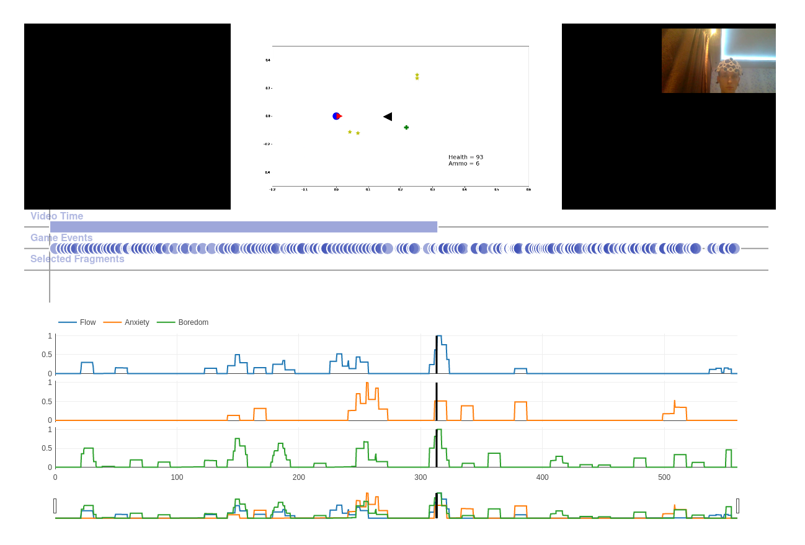

## Gameplay Indicators (in progress)

Playtests with EEG-based indicators 

## References
[1] [Neural correlates of flow, boredom, and anxiety in gaming](https://scholarsmine.mst.edu/cgi/viewcontent.cgi?article=8812&context=masters_theses)
